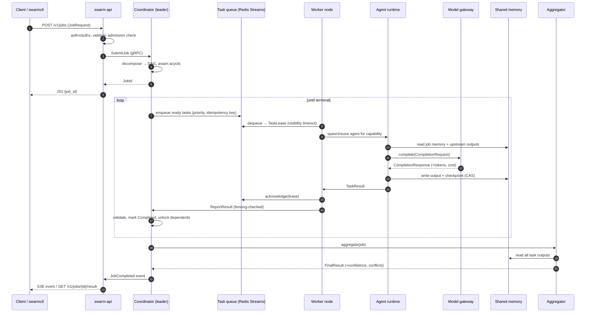
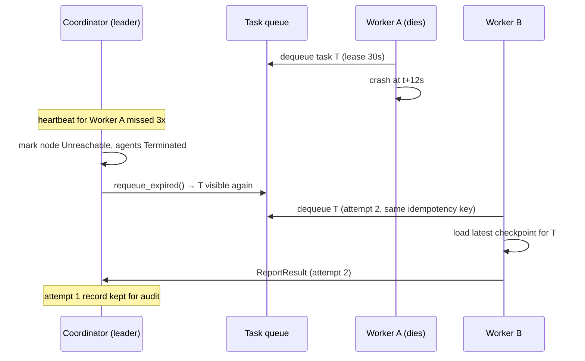
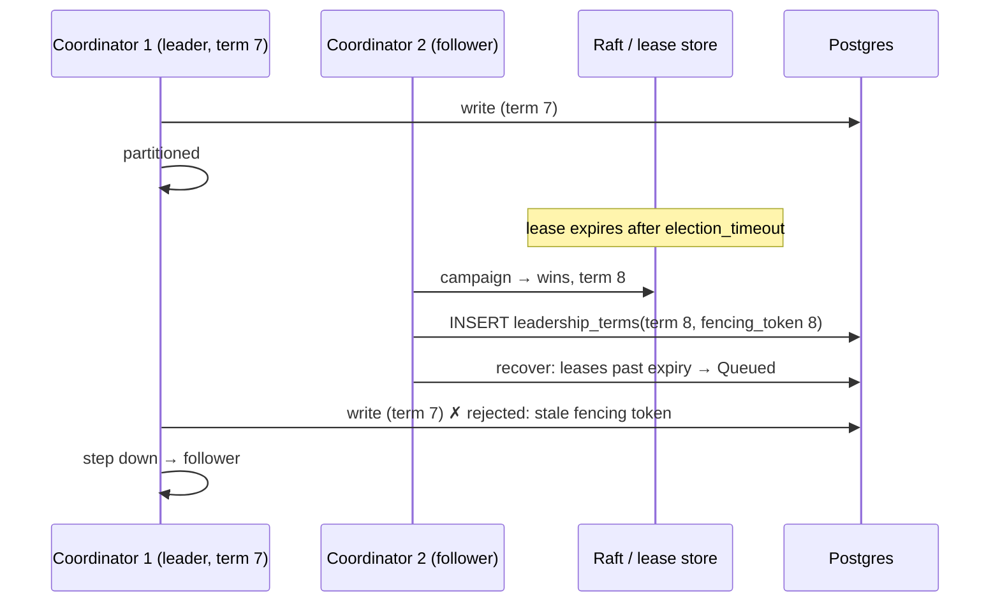
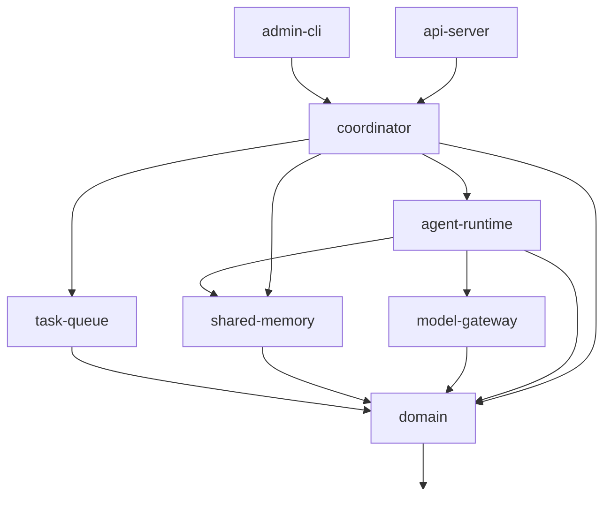

# Architecture

Swarm Platform coordinates hundreds of cooperative LLM agents across worker nodes.
The design goal is a **distributed system that happens to run LLM agents**, not an
LLM app that happens to be distributed: scheduling, leasing, consensus, and recovery
are all explicit, deterministic Rust code. Model calls sit behind one trait at the leaf.

## 1. Services

Each service is a separate binary from the same Cargo workspace. All of them are
stateless except Postgres, Redis/NATS, and object storage.

| # | Service | Binary | Owns | Scale unit |
|---|---------|--------|------|-----------|
| 1 | **API server** | `swarm-api` | HTTP/gRPC ingress, auth, validation, SSE/WS event streams | N replicas, stateless |
| 2 | **Coordinator** | `swarm-coordinator` | Job lifecycle, task graph, admission control, recovery | N replicas, 1 leader |
| 3 | **Cluster membership / election** | in `swarm-coordinator` | Leader election, fencing tokens, node registry, failure detection | co-located with coordinator |
| 4 | **Decomposition** | in `swarm-coordinator` | Objective → task DAG, dynamic revision, split/merge | leader only |
| 5 | **Scheduler** | in `swarm-coordinator` | Task→agent placement, priorities, work stealing, preemption | leader only |
| 6 | **Worker** | `swarm-worker` | Node registration, resource reporting, agent process supervision, lease loop | N nodes |
| 7 | **Agent runtime** | in `swarm-worker` | One agent's execution: prompt assembly, tool policy, checkpointing, validation | M agents per worker |
| 8 | **Shared memory** | `swarm-memory` | Versioned KV + CAS, namespaces, TTL, semantic retrieval, artifacts | N replicas, stateless |
| 9 | **Consensus engine** | in `swarm-coordinator` | Vote collection, normalization, quorum, judge escalation | leader only |
| 10 | **Result aggregator** | `swarm-aggregator` | Schema validation, dedupe, conflict detection, final result assembly | N replicas |
| 11 | **Model gateway** | `swarm-gateway` | Provider abstraction, routing, fallback, rate limit, token/cost accounting, cache | N replicas |
| 12 | **Telemetry** | library `swarm-telemetry` | tracing → OTLP, Prometheus registry, `/metrics`, correlation IDs | linked into every binary |
| 13 | **Benchmark runner** | `swarm-bench` | Load generation, topology sweeps, CSV/JSON reports | run on demand |
| 14 | **Admin CLI** | `swarmctl` | Submit/inspect/cancel, drain nodes, failover drills, DLQ triage | operator laptop |
| 15 | **Dashboard** | `dashboard/` (Next.js) | Live cluster view; read-only except explicit admin actions | static + SSE |

Only the **coordinator leader** mutates global scheduling state. Everything else is
horizontally scalable and idempotent.

## 2. Why the leader is narrow

The leader does exactly four things that require a single writer:

1. Task graph transitions (`Queued → Leased → Running → Completed`)
2. Agent/node assignment decisions
3. Cluster membership changes (join, evict, drain)
4. Recovery decisions (lease expiry → requeue, node loss → reschedule)

Everything else — model calls, memory reads/writes, aggregation, HTTP serving —
runs on followers and workers with no leader involvement. This keeps the
single-writer bottleneck at "a few thousand small Postgres writes per second"
rather than "every model call".

Writes from the leader carry a **fencing token** (monotonic term number). Postgres
rejects any write whose token is below the current term, so a partitioned old
leader cannot corrupt state after losing its lease.

## 3. Data flow



### Failure path: worker dies mid-task



### Failure path: leader dies mid-schedule



## 4. Workspace layout

Domain logic never imports an infrastructure crate. Infrastructure crates implement
traits *defined in* `domain`/`task-queue`/`shared-memory`, so Postgres, Redis, and
OpenAI are all swappable and all mockable in tests.

```text
swarm-platform/
├── Cargo.toml                  # workspace + shared dependency versions
├── crates/
│   ├── domain/                 # types, state machines, task graph. no I/O, no async
│   ├── protocol/               # generated protobuf + envelope helpers (Phase 2)
│   ├── task-queue/             # TaskQueue trait; in-memory + Redis Streams impls
│   ├── shared-memory/          # MemoryStore trait; in-memory + Postgres/Redis impls
│   ├── model-gateway/          # ModelProvider trait, Gateway (fallback/limits/cost)
│   ├── agent-runtime/          # executes one task with one agent
│   ├── coordinator/            # decompose + schedule + execute + aggregate
│   ├── consensus/              # vote modes, quorum, judge escalation (Phase 4)
│   ├── result-aggregator/       # validation + merge pipeline (Phase 4 split)
│   ├── cluster-membership/     # election, fencing, node registry (Phase 3)
│   ├── telemetry/              # tracing/OTel/Prometheus wiring (Phase 5)
│   ├── api-server/             # axum + tonic ingress (Phase 2)
│   ├── worker/                 # worker node binary (Phase 2)
│   ├── admin-cli/              # swarmctl
│   └── benchmark-runner/       # swarm-bench (Phase 6)
├── proto/swarm/v1/             # common.proto, services.proto
├── migrations/                 # sqlx migrations, forward-only
├── dashboard/                  # Next.js monitoring UI (Phase 5)
├── deploy/docker-compose/ , deploy/kubernetes/
├── benchmarks/                 # reports + plot scripts
├── tests/{integration,distributed,chaos}/
└── docs/
```

Crates that exist today are listed in [roadmap.md](roadmap.md); the rest are created
in the phase that first needs them, not up front.

### Dependency direction



No cycles, and `domain` compiles without tokio — so state machines and graph logic
are testable at microsecond speed.

## 5. Execution strategies → DAG shapes

The decomposition engine is a deterministic stage compiler. A strategy is a list of
stages; each stage has a kind (which decides capabilities, validation rules, and
prompt template) and a fan-out. Stage *n* tasks depend on all stage *n-1* tasks.

| Strategy | Stage pipeline |
|----------|----------------|
| Sequential | `plan → work → work → … → summarize` (fan-out 1) |
| Parallel | `plan → work×N → merge` |
| Hierarchical | `plan → subplan×k → work×N → merge → verify` |
| Debate | `answer×N → critique×N → judge` |
| MapReduce | `plan → map×N → reduce` |
| PlannerExecutor | `plan → execute×N → verify` |
| SupervisorWorker | `supervise → work×N → supervise(review) → merge` |
| Consensus | `answer×N → vote → merge` |
| Adaptive | `plan` only; agents insert tasks dynamically at runtime |

Fan-out is `min(max_agents, complexity_estimate)`, bounded by the tenant quota. The
DAG is asserted acyclic (`petgraph::algo::toposort`) before a single task is queued.

## 6. Delivery semantics

The queue is **at-least-once**; execution is made **effectively-once** by three
mechanisms working together:

1. **Idempotency key** = `hash(job_id, task_id, attempt_input_digest)`. Carried on
   the queue entry, the model request, every memory write, and the result record.
2. **Execution record**: the agent checks shared memory for a completed result under
   the idempotency key *before* doing work; a duplicate delivery short-circuits to
   "already done" and just acks.
3. **CAS on every memory write**: two agents racing on the same key produce one
   winner and one `VersionConflict`, never a silent overwrite.

Side effects that are not naturally idempotent (external tool calls) are gated by the
same execution record, written *before* the call and finalized after.

## 7. Backpressure and admission control

Three levels, all fail fast rather than queueing unboundedly:

- **Ingress**: per-tenant token bucket on job submission.
- **Admission**: a job is only accepted if `max_agents` fits inside remaining
  cluster capacity and its cost ceiling fits the tenant budget.
- **Runtime**: bounded channels everywhere; when queue depth per worker exceeds a
  high-water mark, workers stop extending leases for low-priority tasks and the
  coordinator stops promoting `Created → Queued`.

Every bound is configurable and exported as a metric, so saturation is visible
before it becomes failure.

## 8. Deployment topologies (also the benchmark matrix)

1. Single coordinator, single worker node (dev, `cargo run`)
2. 3 coordinators, 1 worker node (election correctness)
3. 3 coordinators, N worker nodes (throughput scaling)
4. Centralized vs hierarchical scheduling (coordination overhead)
5. Memory-heavy / message-heavy / CPU-heavy / model-heavy workload mixes

Docker Compose covers 1–3 locally; Kubernetes manifests target 3+ with an HPA on
queue depth.
