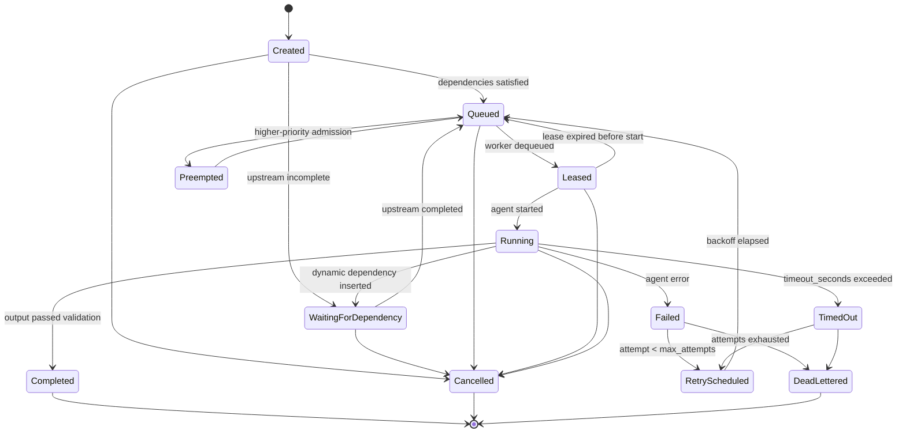
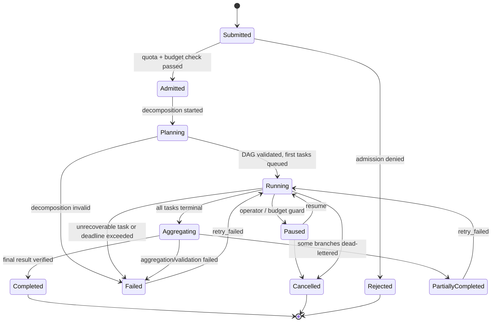
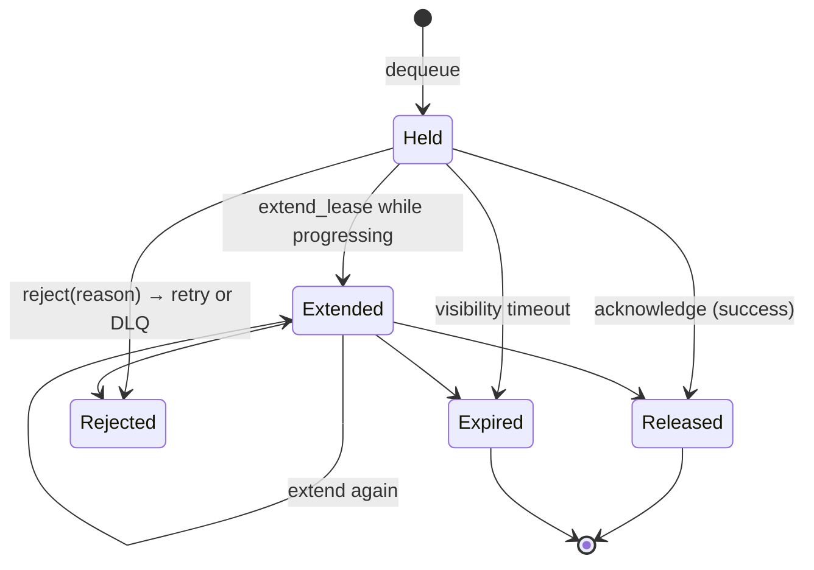
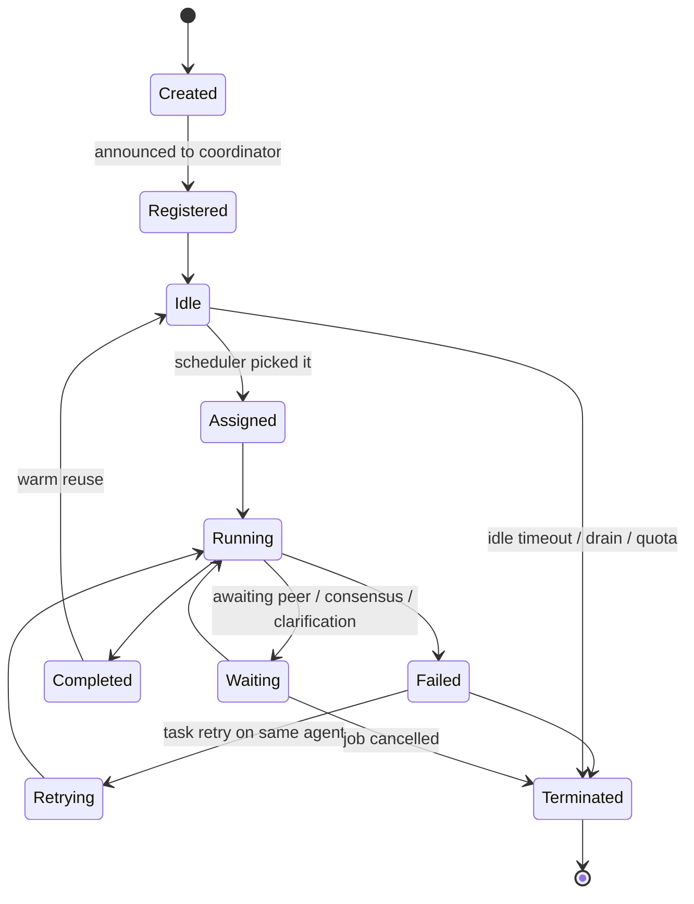
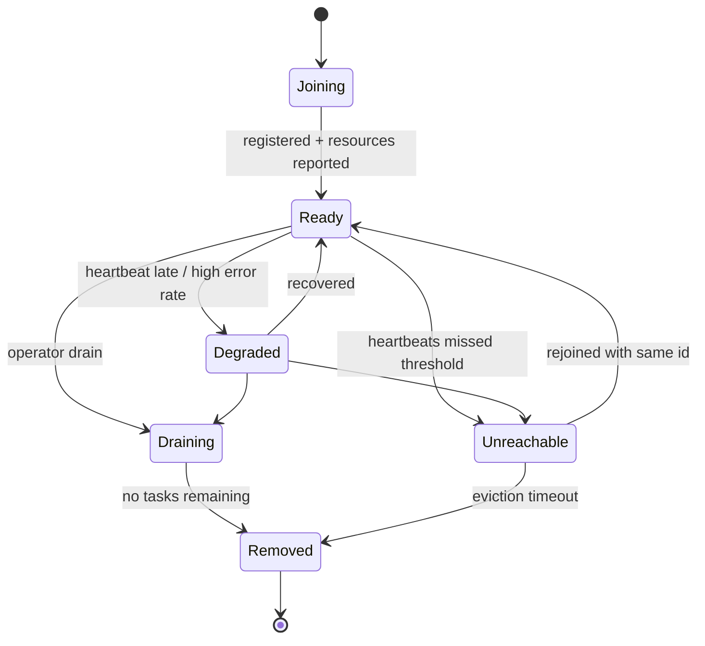

# State machines

Five entities have explicit state machines: **job**, **task**, **lease**, **agent**,
**node**. All are implemented in `crates/domain/src/state.rs` behind one trait:

```rust
pub trait StateMachine: Copy + PartialEq {
    fn allowed(self) -> &'static [Self];
    fn is_terminal(self) -> bool;
    fn transition(self, to: Self) -> Result<Self>;   // errors on illegal edge
}
```

Illegal transitions return `SwarmError::InvalidTransition { entity, from, to }` — they
are never silently ignored, and every legal transition is journaled as:

| column | meaning |
|--------|---------|
| `from_state`, `to_state` | the edge taken |
| `actor` | `coordinator:<id>`, `worker:<id>`, `agent:<id>`, `user:<sub>`, `system` |
| `reason` | short machine-readable cause (`lease_expired`, `validation_failed`, …) |
| `at` | UTC timestamp |
| `correlation_id` | ties the transition to the request/message that caused it |

History is append-only (`job_state_transitions`, `task_state_transitions`,
`task_attempts`), so "what happened to task X" is a query, not an investigation.

## Task



Terminal: `Completed`, `Cancelled`, `DeadLettered`.

Notes:
- `Leased → Queued` is the recovery edge; it is driven by lease expiry, never by a
  worker-liveness guess.
- Retry backoff is `min(base * 2^attempt, max)` plus jitter, stored as the queue
  entry's `available_at`.
- `Running → WaitingForDependency` supports an agent discovering it needs new work
  (Adaptive strategy); the new task is inserted and the DAG re-validated as acyclic.

## Job



Terminal: `Completed`, `Cancelled`, `Rejected`. `Failed` and `PartiallyCompleted` are
*resting* states — a retry moves them back to `Running` with only the failed subgraph
re-queued.

## Lease



A worker holding an `Expired` lease has its `acknowledge` refused, so a slow worker
cannot ack a task another worker already redid.

## Agent



`Completed → Idle` is the warm-pool edge: agents are reused rather than rebuilt,
which is what keeps 500-agent runs cheap.

## Node



`Unreachable` triggers rescheduling of that node's unfinished tasks, but the node may
still rejoin — so its identity is kept until the eviction timeout, and any late result
it reports is accepted only if the task has not already been completed by someone else
(checked by idempotency key).
